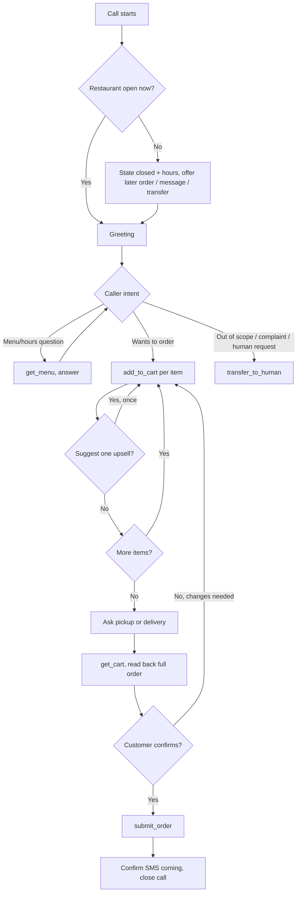

# Voice agent tool/function definitions

This maps the conversation flow in [system_prompt.md](system_prompt.md) to the actual webhook API implemented in `app/controllers/api/voice/`. It's written platform-agnostically since Phase 0 (picking Retell AI vs. Vapi) hasn't happened yet — once a platform is chosen, this doc is the source of truth for configuring its custom functions/tools, and only the *how you configure it* differs, not the endpoints themselves.

## Setup notes (apply to every tool below)

- **Base URL**: your app's public URL (via ngrok in local dev, e.g. `https://xxxx.ngrok-free.app`).
- **Auth header**: every request needs `Authorization: Bearer <VOICE_WEBHOOK_SECRET>`. Both Retell and Vapi let you set a static custom header per tool/webhook — set this once when configuring each tool.
- **`call_id`**: every tool URL below includes `{{call_id}}`. This is **not** an LLM-supplied argument — it's a platform dynamic variable that gets substituted automatically from the call session, the same way on every tool call. Do not add `call_id` to a tool's parameter schema; the LLM never sees or reasons about it.
- **Call lifecycle webhooks** (`create` and `end_call` below) are configured differently from the tools — as the platform's call-start/call-end webhook URLs, not as LLM-callable functions. The LLM never invokes these directly.

## Call lifecycle (not LLM tools)

### Call start

Configure this as the platform's "call started" / inbound webhook.

```
POST {{base_url}}/api/voice/calls
{
  "external_call_id": "<platform's call id>",
  "from": "<caller phone number>",
  "to": "<the restaurant's phone number that was dialed>"
}
```

Response includes `restaurant.name`, `restaurant.open_now`, and `restaurant.hours_today` — inject these into the system prompt as dynamic variables (`{{restaurant_name}}`, `{{open_now}}`, `{{hours_today}}`) before the greeting.

### Call end

Configure as the platform's "call ended" webhook, firing once the call disconnects.

```
POST {{base_url}}/api/voice/calls/{{call_id}}/end_call
{
  "transcript": "<full transcript text>",
  "recording_url": "<recording URL, if available>",
  "status": "completed" | "abandoned"   // optional; inferred from order state if omitted
}
```

## LLM tools

### get_menu

Fetch the current menu, including prices, descriptions, and suggested pairings. Call this before discussing any menu item — never rely on memory of a previous call.

```json
{
  "name": "get_menu",
  "description": "Get the restaurant's current menu: categories, items, prices, modifiers, and suggested pairings. Call this before answering any question about what's available or before adding items to the order.",
  "method": "GET",
  "url": "{{base_url}}/api/voice/calls/{{call_id}}/menu",
  "parameters": { "type": "object", "properties": {}, "required": [] }
}
```

### add_to_cart

```json
{
  "name": "add_to_cart",
  "description": "Add an item to the customer's order. Use the numeric id from get_menu results for menu_item_id and modifier_ids — never guess an id.",
  "method": "POST",
  "url": "{{base_url}}/api/voice/calls/{{call_id}}/cart_items",
  "parameters": {
    "type": "object",
    "properties": {
      "menu_item_id": { "type": "integer", "description": "The id of the menu item from get_menu" },
      "quantity": { "type": "integer", "description": "How many of this item, defaults to 1" },
      "modifier_ids": {
        "type": "array",
        "items": { "type": "integer" },
        "description": "Ids of any selected modifiers for this item, from get_menu"
      },
      "notes": { "type": "string", "description": "Optional special instructions for this item" }
    },
    "required": [ "menu_item_id" ]
  }
}
```

### update_cart_item_quantity

```json
{
  "name": "update_cart_item_quantity",
  "description": "Change the quantity of an item already in the cart. Use the order_item_id returned by add_to_cart or get_cart.",
  "method": "PATCH",
  "url": "{{base_url}}/api/voice/calls/{{call_id}}/cart_items/{order_item_id}",
  "parameters": {
    "type": "object",
    "properties": {
      "order_item_id": { "type": "integer" },
      "quantity": { "type": "integer" }
    },
    "required": [ "order_item_id", "quantity" ]
  }
}
```

### remove_cart_item

```json
{
  "name": "remove_cart_item",
  "description": "Remove an item from the cart entirely. Use the order_item_id returned by add_to_cart or get_cart.",
  "method": "DELETE",
  "url": "{{base_url}}/api/voice/calls/{{call_id}}/cart_items/{order_item_id}",
  "parameters": {
    "type": "object",
    "properties": { "order_item_id": { "type": "integer" } },
    "required": [ "order_item_id" ]
  }
}
```

### get_cart

Use this right before reading the order back to the customer for final confirmation.

```json
{
  "name": "get_cart",
  "description": "Get the current cart contents and running total, to read back to the customer for confirmation.",
  "method": "GET",
  "url": "{{base_url}}/api/voice/calls/{{call_id}}/cart",
  "parameters": { "type": "object", "properties": {}, "required": [] }
}
```

### submit_order

Only call this after the customer has explicitly confirmed the full order read-back.

```json
{
  "name": "submit_order",
  "description": "Finalize and submit the order. Only call this after reading back the full cart and total and getting explicit confirmation from the customer.",
  "method": "POST",
  "url": "{{base_url}}/api/voice/calls/{{call_id}}/submit",
  "parameters": {
    "type": "object",
    "properties": {
      "fulfillment_type": { "type": "string", "enum": [ "pickup", "delivery" ] },
      "delivery_address": { "type": "string", "description": "Required if fulfillment_type is delivery" },
      "notes": { "type": "string", "description": "Optional order-level notes" }
    },
    "required": [ "fulfillment_type" ]
  }
}
```

### transfer_to_human

This only logs the transfer in our system — pair it with the platform's own native call-transfer action (SIP refer / dial-out to the restaurant's real line), which is configured separately and not part of this webhook API.

```json
{
  "name": "transfer_to_human",
  "description": "Log that this call is being handed off to a human. Call this whenever transferring the call, alongside the platform's native transfer action.",
  "method": "POST",
  "url": "{{base_url}}/api/voice/calls/{{call_id}}/transfer",
  "parameters": {
    "type": "object",
    "properties": { "reason": { "type": "string", "description": "Why the call is being transferred, for the call log" } },
    "required": []
  }
}
```

## Call flow diagram


